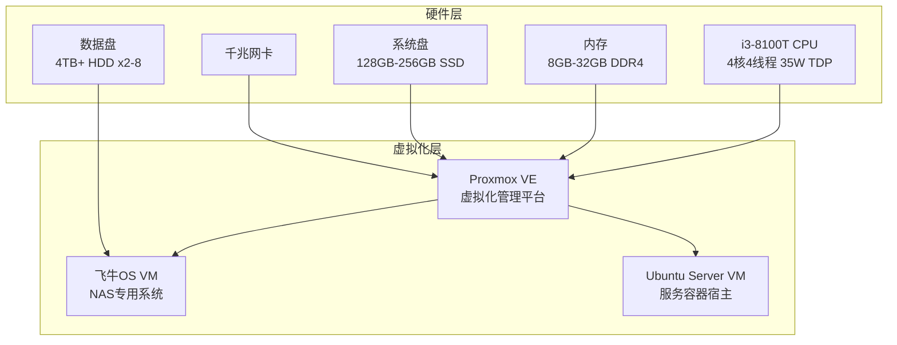
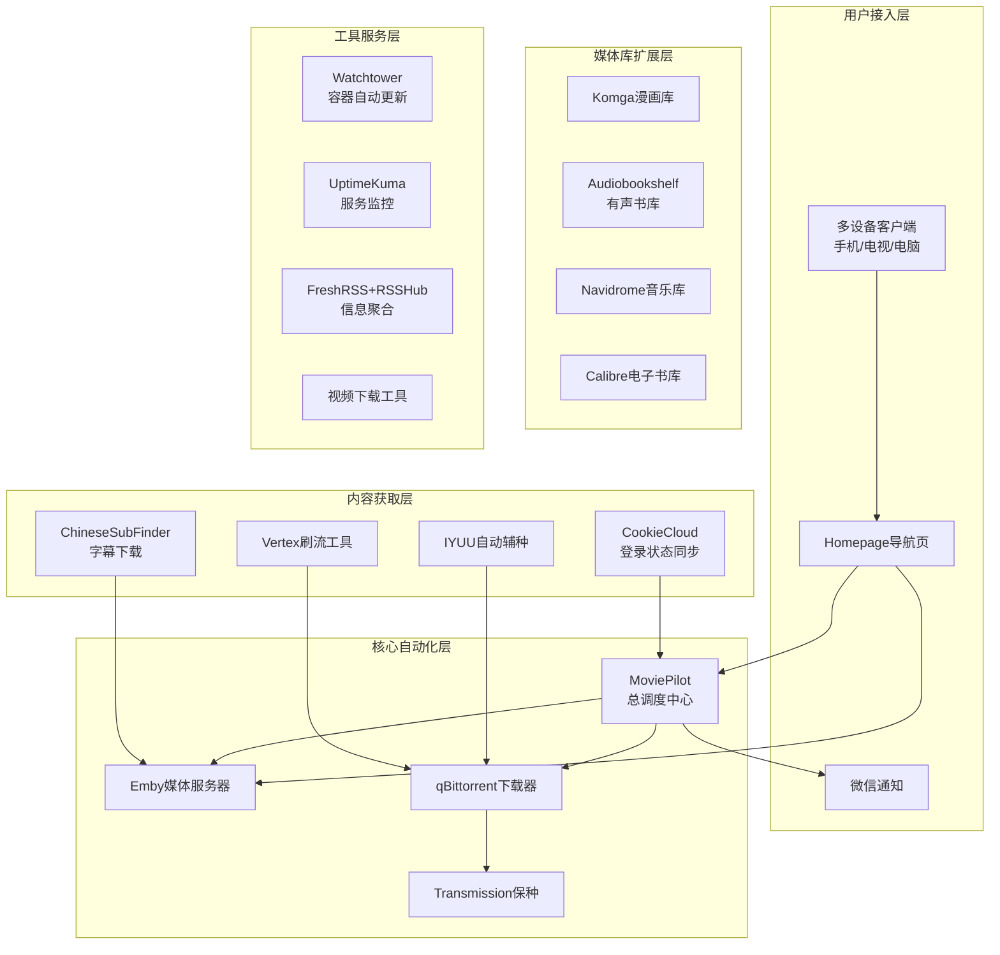
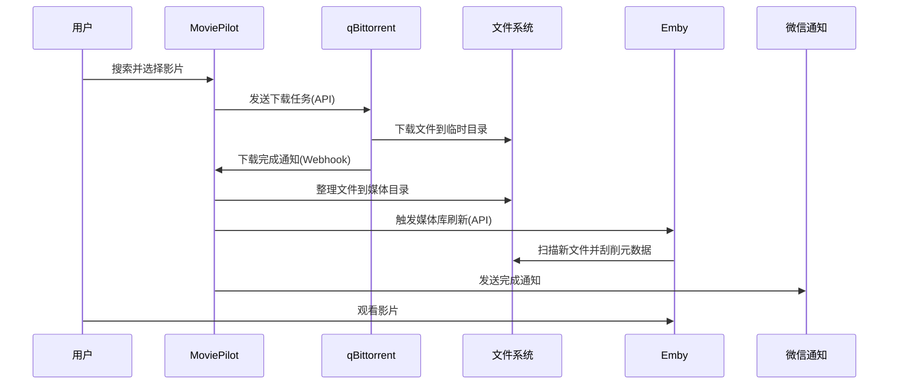
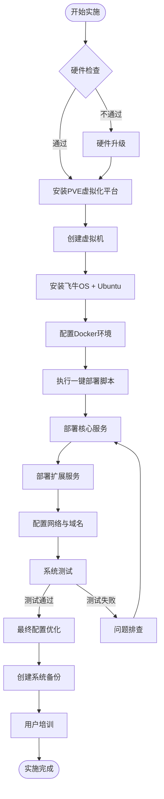
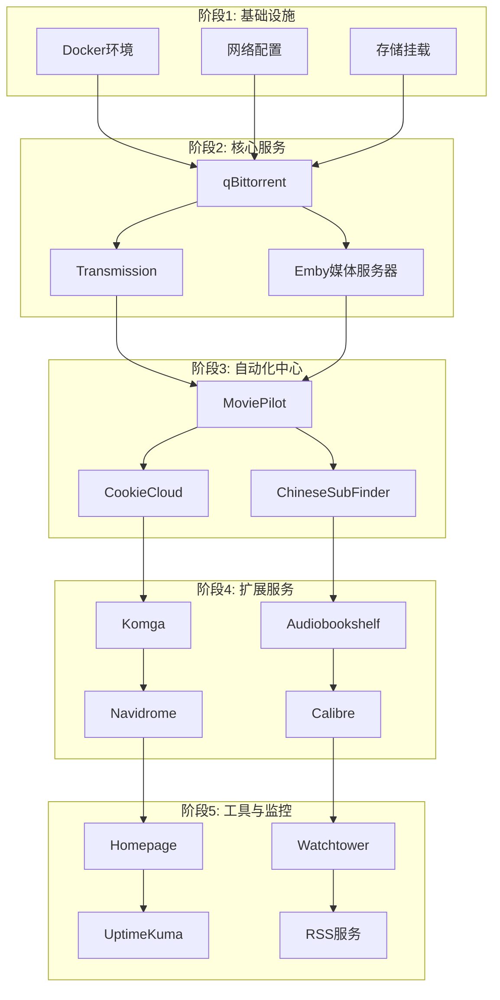
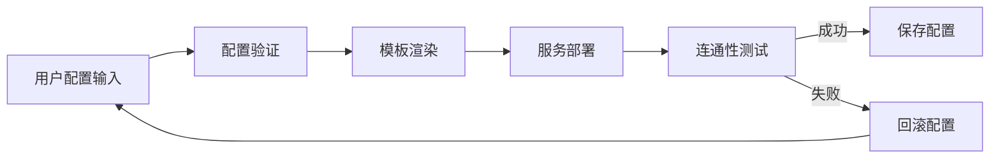
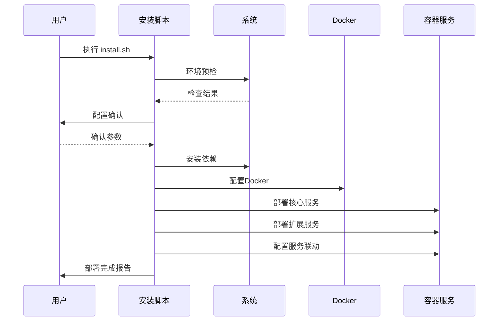
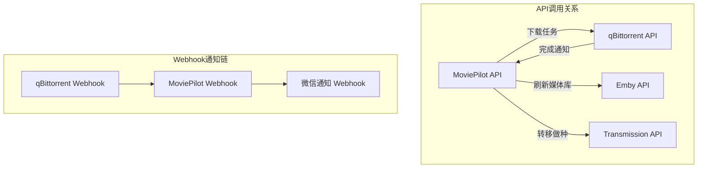
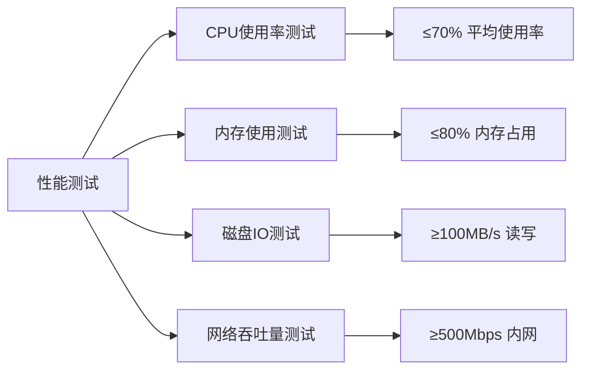
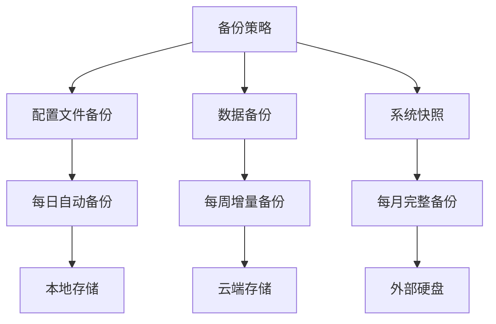

# NAS 终极自动化影音管理系统 - 部署实施方案

## 概述

本项目旨在构建一个全自动化的家庭数字媒体中心，基于"想看什么，点一下，然后就能在 Emby 里直接看"的核心理念。系统通过 MoviePilot 作为总调度中心，协调 50+个 Docker 容器，实现从内容发现、自动下载、媒体整理到推送通知的完整自动化流水线。

### 核心价值

- **全自动化流水线**: 用户需求 → MoviePilot 调度 → 下载器执行 → 媒体库整理 → 微信通知
- **一站式数字生活中心**: 涵盖影视、音乐、漫画、电子书、有声书等全媒体类型
- **PT 生态深度集成**: 自动辅种、刷流、Cookie 同步等高级功能
- **极致用户体验**: Homepage 导航页 + 微信通知 + 多设备访问

## 技术架构

### 硬件架构图



### 软件架构图



### 数据流架构



## 系统配置规格

### 推荐配置对比

| 配置方向       | 基础存储型                         | 性能扩展型                               | 极致节能型               |
| -------------- | ---------------------------------- | ---------------------------------------- | ------------------------ |
| **定位**       | 满足基本存储需求                   | 兼顾性能与扩展                           | 追求最低功耗             |
| **CPU**        | i3-8100T (35W TDP)                 | i3-8100T (35W TDP)                       | i3-8100T (35W TDP)       |
| **主板**       | 华擎 Z370M-ITX<br/>6 SATA + 双 M.2 | 超微 X11SSM-F<br/>8 原生 SATA + ECC 支持 | H310/B360 ITX<br/>4 SATA |
| **内存**       | 8GB DDR4                           | 32GB DDR4 ECC                            | 8GB DDR4                 |
| **系统盘**     | 128GB SATA SSD                     | 256GB NVMe SSD                           | 64GB SATA SSD            |
| **数据盘**     | 4TB HDD × 2                        | 按需扩展                                 | 4TB HDD × 1              |
| **预计成本**   | ¥1000-1200                         | ¥1800-2200                               | ¥900-1100                |
| **功耗(待机)** | 20-25W                             | 25-30W                                   | 15-20W                   |
| **功耗(满载)** | 50-70W                             | 60-85W                                   | 40-60W                   |

## 容器服务清单

### 核心自动化服务

| 服务名称         | 功能描述                     | 端口 | 依赖关系          |
| ---------------- | ---------------------------- | ---- | ----------------- |
| **MoviePilot**   | 总调度中心，媒体库自动化管理 | 3001 | qBittorrent, Emby |
| **Emby**         | 媒体服务器，影视库管理       | 8096 | 文件系统挂载      |
| **qBittorrent**  | 主力下载器                   | 8080 | Transmission      |
| **Transmission** | 保种下载器                   | 9091 | qBittorrent       |

### 内容获取与处理

| 服务名称             | 功能描述         | 端口  | 依赖关系    |
| -------------------- | ---------------- | ----- | ----------- |
| **CookieCloud**      | Cookie 同步服务  | 8088  | MoviePilot  |
| **ChineseSubFinder** | 中文字幕自动下载 | 19035 | Emby        |
| **IYUU**             | 自动辅种工具     | 8780  | qBittorrent |
| **Vertex**           | PT 刷流工具      | 3000  | qBittorrent |

### 媒体库扩展

| 服务名称           | 功能描述       | 端口  | 依赖关系     |
| ------------------ | -------------- | ----- | ------------ |
| **Komga**          | 漫画服务器     | 25600 | 漫画文件目录 |
| **Tachidesk**      | 在线漫画聚合器 | 4567  | Komga        |
| **Audiobookshelf** | 有声书服务器   | 13378 | 音频文件目录 |
| **Navidrome**      | 音乐服务器     | 4533  | 音乐文件目录 |
| **Calibre**        | 电子书管理     | 8083  | 图书文件目录 |
| **Reader**         | 小说阅读服务器 | 8080  | 小说文件目录 |

### 工具与监控

| 服务名称       | 功能描述     | 端口 | 依赖关系     |
| -------------- | ------------ | ---- | ------------ |
| **Homepage**   | 统一导航页面 | 3000 | 所有服务     |
| **Watchtower** | 容器自动更新 | -    | Docker       |
| **UptimeKuma** | 服务监控告警 | 3001 | 所有服务     |
| **FreshRSS**   | RSS 阅读器   | 8080 | RSSHub       |
| **RSSHub**     | RSS 生成器   | 1200 | FreshRSS     |
| **Metube**     | 视频下载工具 | 8081 | 视频存储目录 |

## 目录结构设计

### 数据存储架构

```
/opt/nas-data/
├── downloads/                    # 下载临时目录
│   ├── complete/                # 完成下载
│   ├── incomplete/              # 下载中
│   └── watch/                   # 监控目录
├── media/                       # 媒体库根目录
│   ├── movies/                  # 电影
│   ├── tv/                      # 电视剧
│   ├── anime/                   # 动漫
│   ├── music/                   # 音乐
│   ├── audiobooks/              # 有声书
│   ├── comics/                  # 漫画
│   ├── books/                   # 电子书
│   └── novels/                  # 小说
├── config/                      # 配置文件目录
│   ├── moviepilot/
│   ├── emby/
│   ├── qbittorrent/
│   └── [other-services]/
└── scripts/                     # 脚本目录
    ├── install.sh               # 一键安装脚本
    ├── backup.sh                # 备份脚本
    └── monitor.sh               # 监控脚本
```

### 网络端口规划

```
核心服务端口段: 8000-8099
- MoviePilot: 8001
- Emby: 8096
- qBittorrent: 8080
- CookieCloud: 8088

扩展服务端口段: 9000-9099
- Transmission: 9091
- IYUU: 9780
- UptimeKuma: 9001

专用服务端口段: 25000+
- Komga: 25600
- Audiobookshelf: 25378
- Navidrome: 25533

工具服务端口段: 3000-3099
- Homepage: 3000
- Vertex: 3030
```

## 实施流程图

### 总体实施流程



### 服务部署顺序



## 一键部署脚本设计

### 主安装脚本架构

```bash
#!/bin/bash
# NAS自动化系统一键部署脚本
# 版本: v1.0
# 支持系统: Ubuntu 20.04+, Debian 11+

# 脚本结构:
install.sh                      # 主入口脚本
├── scripts/
│   ├── 00-precheck.sh          # 环境预检
│   ├── 01-system-setup.sh      # 系统基础配置
│   ├── 02-docker-setup.sh      # Docker环境安装
│   ├── 03-network-setup.sh     # 网络配置
│   ├── 04-storage-setup.sh     # 存储配置
│   ├── 05-core-services.sh     # 核心服务部署
│   ├── 06-extend-services.sh   # 扩展服务部署
│   ├── 07-monitoring.sh        # 监控服务部署
│   ├── 08-final-config.sh      # 最终配置
│   └── 99-cleanup.sh           # 清理工作
├── config/
│   ├── docker-compose.yml      # 主要容器编排
│   ├── .env.template           # 环境变量模板
│   └── services/               # 各服务配置模板
└── utils/
    ├── backup.sh               # 备份脚本
    ├── update.sh               # 更新脚本
    └── monitor.sh              # 监控脚本
```

### 配置管理机制



### 脚本执行流程



## 服务联动配置

### API 集成关系



### 关键配置参数

| 服务对                   | 配置项      | 参数值示例                                 | 说明            |
| ------------------------ | ----------- | ------------------------------------------ | --------------- |
| MoviePilot → qBittorrent | API 地址    | `http://qbittorrent:8080`                  | 下载器 API 端点 |
| MoviePilot → Emby        | API 密钥    | `{EMBY_API_KEY}`                           | 媒体库管理权限  |
| qBittorrent → MoviePilot | Webhook URL | `http://moviepilot:3001/api/v1/webhook/qb` | 下载完成通知    |
| IYUU → qBittorrent       | 种子目录    | `/downloads/complete`                      | 辅种源目录      |
| ChineseSubFinder → Emby  | 媒体目录    | `/media`                                   | 字幕匹配目录    |

## 测试验证方案

### 功能测试矩阵

| 测试模块     | 测试项目        | 预期结果             | 验证方法     |
| ------------ | --------------- | -------------------- | ------------ |
| **下载流程** | MoviePilot 搜索 | 返回搜索结果         | Web 界面操作 |
|              | 添加下载任务    | qBittorrent 开始下载 | 检查下载状态 |
|              | 下载完成处理    | 文件自动整理         | 检查媒体目录 |
| **媒体库**   | Emby 扫描       | 新内容出现在库中     | Web 界面验证 |
|              | 元数据刮削      | 海报、简介显示正常   | 媒体详情页   |
|              | 多设备播放      | 客户端正常播放       | 移动端测试   |
| **通知系统** | 微信通知        | 接收完成消息         | 微信验证     |
| **PT 功能**  | 自动辅种        | IYUU 添加新种子      | 种子列表检查 |
|              | 刷流功能        | Vertex 获取上传量    | PT 站点数据  |
| **监控**     | 服务状态        | UptimeKuma 显示在线  | 监控页面     |

### 性能基准测试



## 运维与维护

### 监控指标体系

| 监控维度     | 关键指标     | 告警阈值       | 处理策略           |
| ------------ | ------------ | -------------- | ------------------ |
| **系统资源** | CPU 使用率   | >80%           | 自动重启高负载容器 |
|              | 内存使用率   | >85%           | 清理缓存，重启服务 |
|              | 磁盘空间     | >90%           | 清理下载临时文件   |
| **服务状态** | 容器运行状态 | 停止>5 分钟    | 自动重启容器       |
|              | API 响应时间 | >5 秒          | 服务重启           |
|              | 网络连通性   | 连接失败       | 网络诊断           |
| **业务指标** | 下载速度     | <10MB/s        | 检查网络和种子     |
|              | 媒体库更新   | >30 分钟无响应 | 强制刷新           |

### 备份恢复策略



### 自动化运维脚本

```bash
# 监控脚本示例
monitor.sh
├── check_services()        # 检查服务状态
├── check_resources()       # 检查系统资源
├── check_disk_space()      # 检查磁盘空间
├── send_alert()           # 发送告警
└── auto_recovery()        # 自动恢复

# 备份脚本示例
backup.sh
├── backup_configs()       # 备份配置文件
├── backup_database()      # 备份数据库
├── cleanup_old_backups()  # 清理旧备份
└── verify_backup()        # 验证备份完整性

# 更新脚本示例
update.sh
├── check_updates()        # 检查更新
├── backup_before_update() # 更新前备份
├── update_containers()    # 更新容器
└── verify_after_update()  # 更新后验证
```

这个完整的实施方案为你的 NAS 自动化影音管理系统提供了从硬件选型到软件部署，从架构设计到运维维护的全方位指导。通过一键部署脚本，可以大大简化后续为其他客户提供服务的流程。

请查看这个设计方案，看是否符合你的需求。如有需要调整的地方，请告诉我。
