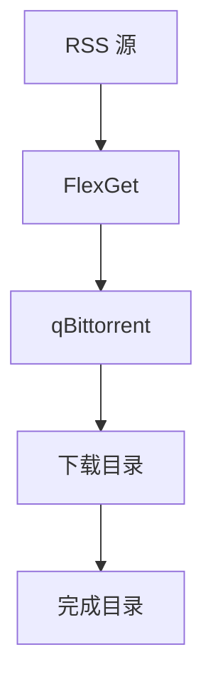

# 最简自动追番系统

## 简介

这是一个基于 Docker 的最简自动追番系统，专为动漫爱好者设计。系统通过 RSS 订阅方式自动获取新番资源，并使用 qBittorrent 进行下载，FlexGet 作为自动化调度工具。

## 核心特性

- **极简设计**: 仅使用 2 个核心容器 (qBittorrent + FlexGet)
- **多站点支持**: 支持 Mikan Project、动漫花园、萌番组等多个公共站点
- **RSS 订阅**: 自动监控 RSS 源获取最新番剧
- **智能分类**: 自动将下载完成的文件分类整理
- **空间管理**: 自动管理磁盘空间，避免占满硬盘
- **易于配置**: 通过配置文件轻松定制订阅规则

## 系统架构



## 组件说明

### qBittorrent
- **功能**: 主下载器，支持 BT 和磁力链接
- **端口**: 8080 (Web UI)
- **默认账号**: admin / adminadmin

### FlexGet
- **功能**: 自动化调度工具，监控 RSS 并触发下载
- **端口**: 5050 (Web UI)
- **默认账号**: flexget / password123

## 快速开始

### 1. 环境要求
- Docker 19.03+
- Docker Compose v2+
- Linux/Windows/macOS

### 2. 安装步骤

```bash
# 克隆项目
git clone https://github.com/your-repo/nas-aio.git
cd nas-aio

# 运行初始化脚本
chmod +x scripts/setup-anime.sh
./scripts/setup-anime.sh
```

### 3. 配置订阅

编辑配置文件:
```bash
nano /opt/nas-data/config/anime-flexget/config.yml
```

修改 RSS 地址:
```yaml
tasks:
  mikan-anime:
    rss: https://mikanani.me/RSS/MyBangumi?token=YOUR_TOKEN_HERE
```

### 4. 启动服务

```bash
# 启动服务
docker-compose -f docker-compose.anime-minimal.yml up -d

# 查看服务状态
docker-compose -f docker-compose.anime-minimal.yml ps
```

## 使用说明

### 访问界面

1. **qBittorrent Web UI**: http://localhost:8080
2. **FlexGet Web UI**: http://localhost:5050

### 目录结构

```
/opt/nas-data/
├── config/
│   ├── anime-qbittorrent/     # qBittorrent 配置
│   └── anime-flexget/         # FlexGet 配置
├── downloads/
│   └── anime/                 # 下载目录
│       ├── mikan/             # Mikan Project 下载
│       ├── dmhy/              # 动漫花园下载
│       └── bangumi-moe/       # 萌番组下载
└── anime/
    └── complete/              # 完成目录
```

### 配置详解

#### RSS 订阅配置

```yaml
tasks:
  mikan-anime:
    rss: https://mikanani.me/RSS/MyBangumi?token=YOUR_TOKEN_HERE
    regexp:
      accept:
        - '.*\.(mp4|mkv|avi)$'  # 只接受视频文件
    qbittorrent:
      path: /downloads/mikan   # 下载到指定目录
```

#### 多站点配置

```yaml
tasks:
  dmhy-anime:
    rss: https://share.dmhy.org/topics/rss.xml
    if:
      - "'動漫' in title": accept  # 标题包含"動漫"的接受
```

#### 调度配置

```yaml
schedules:
  - tasks: [mikan-anime, dmhy-anime, bangumi-moe-anime]
    interval:
      minutes: 30  # 每30分钟检查一次
```

## 管理命令

```bash
# 启动服务
docker-compose -f docker-compose.anime-minimal.yml up -d

# 停止服务
docker-compose -f docker-compose.anime-minimal.yml down

# 重启服务
docker-compose -f docker-compose.anime-minimal.yml restart

# 查看日志
docker-compose -f docker-compose.anime-minimal.yml logs -f

# 查看服务状态
docker-compose -f docker-compose.anime-minimal.yml ps
```

## 常见问题

### 1. 如何添加新的 RSS 源？

在 `config.yml` 中添加新的任务:

```yaml
tasks:
  new-anime-source:
    rss: https://new-site.com/rss
    accept_all: yes
    qbittorrent:
      path: /downloads/new-source
```

### 2. 如何修改下载目录？

修改 `docker-compose.anime-minimal.yml` 中的 volumes 配置:

```yaml
volumes:
  - ${DOWNLOAD_PATH}/anime:/downloads  # 修改右侧路径
```

### 3. 如何修改检查频率？

修改 `config.yml` 中的 schedules 配置:

```yaml
schedules:
  - tasks: [mikan-anime]
    interval:
      minutes: 60  # 改为60分钟
```

### 4. 如何查看下载进度？

访问 qBittorrent Web UI: http://localhost:8080

## 安全建议

1. **修改默认密码**: 首次使用后立即修改 qBittorrent 和 FlexGet 的默认密码
2. **限制访问**: 如果部署在公网，建议使用反向代理和 HTTPS
3. **定期清理**: 定期清理已完成的下载任务和旧文件

## 故障排除

### 服务无法启动

```bash
# 查看详细错误信息
docker-compose -f docker-compose.anime-minimal.yml logs

# 检查端口占用
netstat -tuln | grep -E "(8080|5050)"
```

### 下载任务不执行

```bash
# 检查 FlexGet 日志
docker logs anime-flexget

# 手动测试任务
docker exec anime-flexget flexget execute --test
```

### 磁盘空间不足

```bash
# 清理已完成的种子
docker exec anime-qbittorrent rm -rf /downloads/complete/*

# 增加磁盘空间监控
# 在 config.yml 中添加:
free_space:
  path: /downloads
  space: 10000  # 保留 10GB 空间
```

## 更新升级

```bash
# 拉取最新镜像
docker-compose -f docker-compose.anime-minimal.yml pull

# 重启服务
docker-compose -f docker-compose.anime-minimal.yml up -d
```

## 技术支持

- 项目文档: [GitHub Wiki](https://github.com/your-repo/nas-aio/wiki)
- 问题反馈: [GitHub Issues](https://github.com/your-repo/nas-aio/issues)
- 社区交流: QQ 群 / 微信群

## 许可证

MIT License